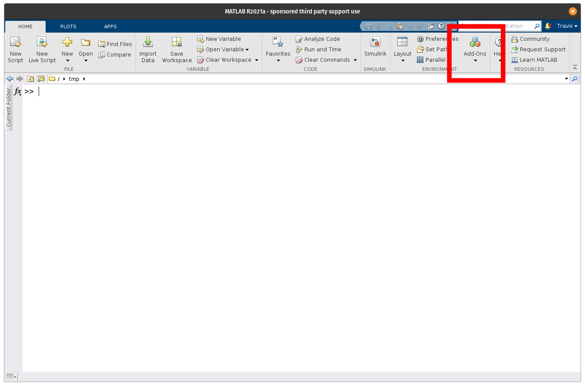
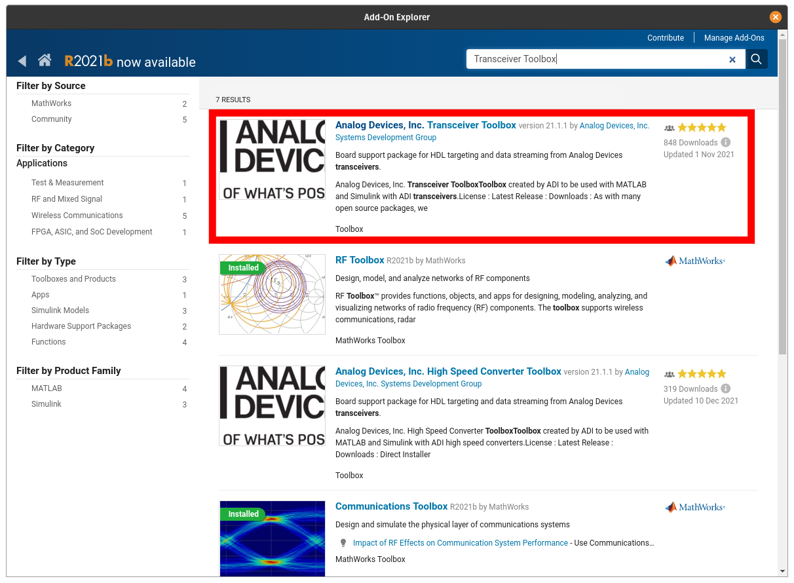


# Installation

## Dependencies

The toolbox has different dependencies based on the features required. These are broken down into the base dependencies for running models, data stream and control, and HDL code generation.

### Simulation Models

The simulation models for the different components can be used in either MATLAB or Simulink through the MATLAB System block. To run the available models requires the following toolboxes from MathWorks:

- [DSP System Toolbox](https://www.mathworks.com/products/dsp-system.html)
- [Signal Processing Toolbox](https://www.mathworks.com/products/signal.html)
- [(Optional) Simulink](https://www.mathworks.com/products/simulink.html)

### Data Streaming with Hardware

The base dependencies for the toolbox requires libiio and the libiio MATLAB bindings. There are three options for this install with different required MathWorks Toolboxes:

- [Communications Toolbox Support Package for Xilinx Zynq-Based Radio](https://www.mathworks.com/help/supportpkg/xilinxzynqbasedradio/index.html)
    - Communications Toolbox
    - Signal Processing Toolbox™
    - DSP System Toolbox™
- [Communications Toolbox Support Package for Analog Devices ADALM-Pluto Radio](https://www.mathworks.com/help/supportpkg/plutoradio/index.html)
    - Communications Toolbox
    - Signal Processing Toolbox™
    - DSP System Toolbox™
- [libiio MATLAB Binding Standalone Installer (R2021b+)](https://github.com/mathworks/buildroot/releases/download/mathworks_zynq_R21.2.0/libiio.mlpkginstall)
    - Signal Processing Toolbox™

## RF and Microwave Toolbox Install

The RF and Microwave Toolbox itself can be installed either from:

- [MATLAB's Add-On Explorer](https://www.mathworks.com/products/matlab/add-on-explorer.html) 
- [GitHub Releases page](https://github.com/analogdevicesinc/RFMicrowaveToolbox/releases).

!!! warning "MATLAB Versions"
    Before installing RF and Microwave Toolbox check the [Release Page](https://github.com/analogdevicesinc/RFMicrowaveToolbox/releases) to check for the latest supported version of MATLAB. The latest version is the one which is available in [Add-on Explorer](https://www.mathworks.com/products/matlab/add-on-explorer.html), since Add-On Explorer does not currently support hosting multiple versions. If you have an older release of MATLAB, download the MLTBX installer from matching release on the [Release Page](https://github.com/analogdevicesinc/RFMicrowaveToolbox/releases).

### Add-On Explorer Walkthrough

To install the toolbox from within MATLAB using the Add-On Explorer, first launch the Explorer from MATLAB's Home tab:

Search for the toolbox:

<!--  -->

Select RF and Microwave Toolbox from results:

<!--  -->

Select add:

<!--  -->

