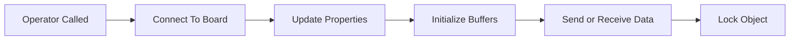


# Receiving and Sending Data

Remote data streaming to and from hardware is made available through [system object interfaces](https://www.mathworks.com/help/matlab/matlab_prog/what-are-system-objects.html), which are unique for each component or platform. The hardware interfacing system objects provide a since class to both configure a given platform and move data back and forth from the device.

Command and control of hardware from MATLAB is accomplished by leveraging the [IIO drivers](https://wiki.analog.com/software/linux/docs/iio/iio) built into the target platform's kernel and [libiio](https://wiki.analog.com/resources/tools-software/linux-software/libiio) which provides remote backends to control drivers across different backends. Backends can be Ethernet, serial, or USB based. Below is a diagram of the different components in the stack for an FMComms based systems, but will be nearly identical for all libiio-based systems.


Since libiio is cross-platform it can be used from Windows, Linux, or macOS based systems. It is also a lower level library independent of MATLAB, so when moving toward production or untethered systems similar APIs that are used in MATLAB can be used in C,C++,Python, or other languages.

## Connecting and Configuration

Connecting to hardware is done by setting the **uri** property of the system object interface. The **uri** for libiio always has the convention "*< backend >:< address >*", where *backend* can be ip, usb, or serial. *address* will be specific to the backend. This is documented in the [libiio API](https://analogdevicesinc.github.io/libiio/master/libiio/group__Context.html#gafdcee40508700fa395370b6c636e16fe).

Below is a basic example of setting up an AD9081 receiver and the Stingray class in an X-band development kit using an Ethernet/IP backend:
```linenums="1"
uri = 'ip:192.168.1.211';

rx = adi.AD9081.Rx;
rx.uri = uri;
rx.EnabledChannels = [1 2 3 4];
rx.MainNCOFrequencies = ones(1,4)*550e6; %NCO Frequency
rx.SamplesPerFrame = 2^12; %Number Of Samples To Capture: 4096
rx.kernelBuffersCount = 1; %Number Of Buffers To Subsequently Capture
rx.EnablePFIRs = true; %MxFE pFIR Configuration; false: Don't Use pFIRs, true: Use pFIRs
data = rx(); %Initialize The Rx System; Grab The Rx Data Into 'data' Matrix

% Setup ADAR1000EVAL1Z in RX Mode
sray = adi.Stingray;
sray.uri = uri;
sray.Frequency = 10e9;
sray.Mode(:) = {'Rx'}; %set mode, 'Rx', 'Tx, 'Disabled'
sray.RxAttn(:) = 1; %1: Attenuation Off, 0: Attenuation On
sray.SteerRx(0,0); %Broadside
sray.RxGain(:) = 127; %127: Highest Gain, 0: Lowest Gain, Decimal Value
sray.LatchRxSettings; %Latch SPI settings to devices
sray(); %constructor to write properties to hardware
```
With the code above, the hardware is not contacted until the operator or step method is called on lines 10 and 21. Therefore, any properties that are set or defined before these lines are not applied or updated on the hardware until after these lines. However, after lines 10 and 21 have executed the object will become locked and certain configuration changes cannot be applied after this point. These will primarily sample rates and buffer sizes.

The state of the object follows the flow of the diagram below triggered by lines 10 and 21 above.


Once the object becomes locked it must be released if the sample rate or buffers need to be modified. This will disconnect from the hardware:
```
rx.release(); % Release AD9081 object
sray.release(); % Release Stingray Object
```

For more details on documentation related to using the AD9081 high-speed converter, see this [page.](https://github.com/analogdevicesinc/HighSpeedConverterToolbox/tree/master/hsx_examples)
